# Q1. Summary

- The aim of the project was to understand classification of 2 different types of datasets:
  - A Multi label image classification data set
  - A Sequential sentence classification data set
- The first part of the project takes a well separated list of 100 sporting categories of images from kaggle and understanding the dataset
- After understanding the dataset the main focus was to perform a comparative analysis of how different tensorflow models performs with this dataset without any preprocessing
- The models used in this project are as follows
  - resnet50
  - MobileNetV2
  - VGG16
  - EfficientNetV2
  - InceptionV3
- After training all the models 2 graphs were constructed to understand the learning of the algorithm:
  - Loss vs epochs for training and validation data
  - Accuracy vs epochs for training and validation data
- Finally a test suit was written to evaluate the model using the following metrics
  - Accuracy
  - Precision
  - Recall
  - F1 score
- A summary of all the results have been created in the form of a data frame.
- The second part of the project involves classification sequential texts into 5 catagories
- The dataset is a sub part of PubMed 200k RCT which has texts and their category
- The main focus of the project was the observe how different sentence encoding will improve the accuracy of the testing data
- The first part involves pre-processing of the dataset and understanding the the dataset by finding the following:
  - Finding the distribution of labels
  - Finding the distribution of number of lines in the training data
  - Finding the count of train, test and validation data
  - Finding the average sentence length of each data
  - Understanding the vocabulary of the training data
- For the classification of texts a tensorflow model was created with the following sentence encoding
  - Custom token encoding using over own dataset.
  - Universal Sentence encoder from tensorflow hub.
  - LELLA Sentence encoder from tensorflow hub.
- After training all the models comparative analysis is done by constructing the following graphs:
  - Loss vs epochs for training and validation data
  - Accuracy vs epochs for training and validation data
- Finally a test suit was written to evaluate the model using the following metrics
  - Accuracy
  - Precision
  - Recall
  - F1 score

# Q2. Dataset Description

## 100 - Image classification

The following dataset is taken from

100 Sports Image Classification. https://www.kaggle.com/datasets/gpiosenka/sports-classification. Accessed 19 Apr. 2023.


The dataset contains 3 folders

- The images for this data set was generated by scrapping the web and all the duplicate images were removed to avoid bleed through of images.[2]
- The dataset was created in such a way that the region of interest in the case of each sport occupies approximately 50% of the pixels in the images. [2]
- Train folder containing 13572 images of size `224*224*3`
- The validation folder contains 500 validation images 5 from each sports
- The test folder contains 500 Test images 5 from each sports
- The total dataset contains a total of 14572 images
- There is also a file name sports.csv
- It contains 3 columns:
  - The file path of each image
  - If the image is in train, test or validation folder
  - The label of the image
- After complete analysis of the sports data the csv file doesn't have any null values
- The count of each label and the composition of each label in the dataset is available in the following link
  - [Image analysis](./outputs/image_data_analysis.txt)
- The following table will give the count and composition of top 10 labels out of 100

| Label             | Count | Composition |
| ----------------- | ----- | ----------- |
| formula 1 racing  | 201   | 1.37936     |
| football          | 201   | 1.37936     |
| nascar racing     | 200   | 1.3725      |
| baseball          | 184   | 1.2627      |
| hockey            | 182   | 1.24897     |
| basketball        | 179   | 1.22838     |
| olympic wrestling | 177   | 1.21466     |
| rings             | 177   | 1.21466     |
| rugby             | 176   | 1.2078      |
| canoe slamon      | 174   | 1.19407     |

### Sample Images from train data


### Sample Images from test data


### Sample Images from validation data


## Pubmed-rct 20k Dataset

The following dataset is taken from

https://github.com/Franck-Dernoncourt/pubmed-rct/tree/master/PubMed_20k_RCT_numbers_replaced_with_at_sign

- The PubMed 20k is a subset of PubMed200k dataset hence abstracts present in PubMed200k is also present in PubMed20k.[3]
- Numbers have been replaced with a `@` in PubMed_20k_RCT_numbers_replaced_with_at_sign.[3]
- The dataset contains a sequence of sentence which are classified into 5 catagories.
  1. Background
  2. Objective
  3. Method
  4. Result
  5. Conclusion
- After analysis of the dataset the distribution of labels were as follows
- Results available in [text data analysis](./outputs/text_data_analysis.txt)


| Label      | Train  | Test  | Valid |
| ---------- | ------ | ----- | ----- |
| Background | 59353  | 9897  | 9964  |
| Objective  | 57953  | 9713  | 9841  |
| Method     | 27168  | 4571  | 4582  |
| Result     | 21727  | 3621  | 3449  |
| Conclusion | 13839  | 2333  | 2376  |
| Total      | 180040 | 30135 | 30212 |
| Average Length | 26.33 | 26.178 | 26.42 |

- On computation of the vocabulary of the train data the observations are 
- Number of words in vocabulary: 64841
- Top 10 common words ['', '[UNK]', 'the', 'and', 'of', 'in', 'to', 'with', 'a', 'were']
- Least 10 common words ['aarm', 'aaqol', 'aaq', 'aanhui', 'aana', 'aainduced', 'aaigroup', 'aachener', 'aachen']
- The main reason to work on this dataset, with automatic classification of sentences in an abstract would help researchers read abstract more effectively, mainly in fields where abstracts may be long, especially in the medical field. 

# Q3. Details

## Results obtained from Classification of Sports Images 

The main focus of this evaluation is to see which models performs well with less number of epochs(10 epochs).

**The Below Graph gives an understanding about the learning of the model for train and validation data** 

| Model | Loss vs Epochs | Accuracy vs Epochs |
| --- | --- | --- |
| resnet50 | 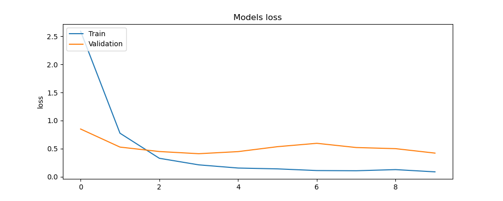 | 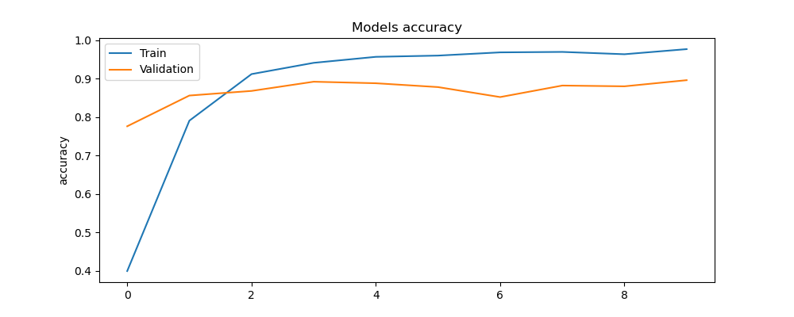 |
| MobileNetV2 | 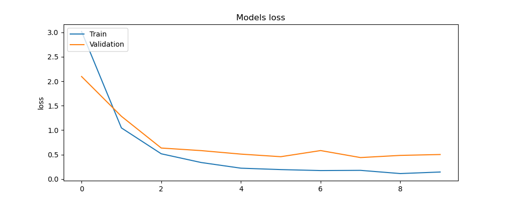 | 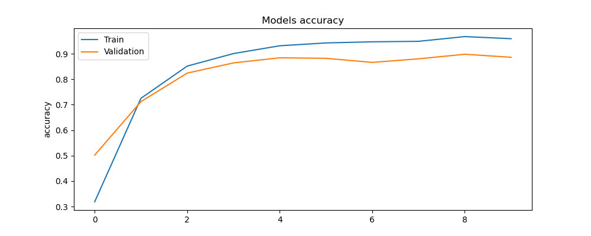 |
| VGG16| 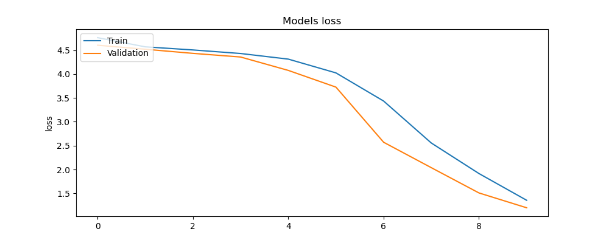 | 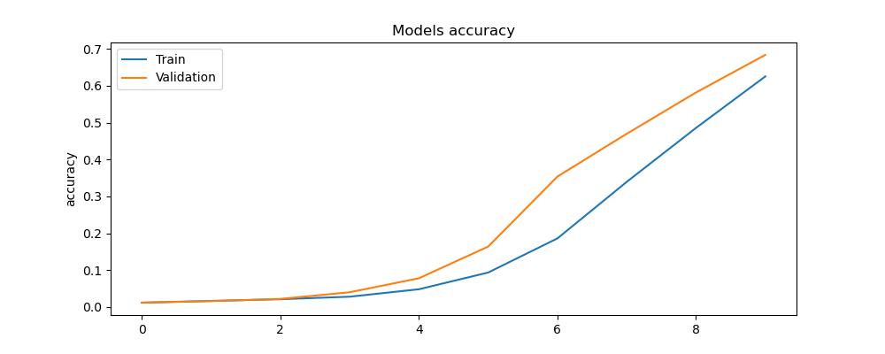 |
| EfficientNetV2 | 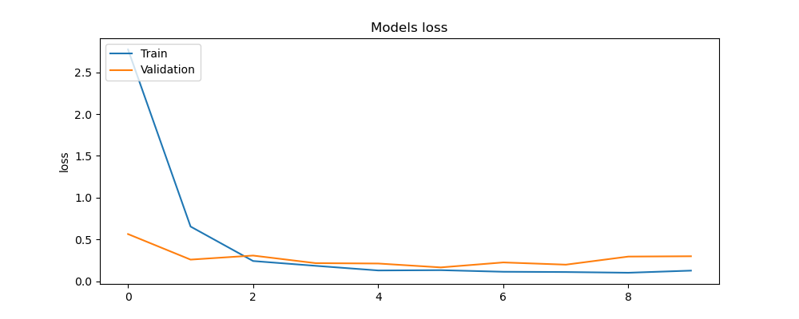 | 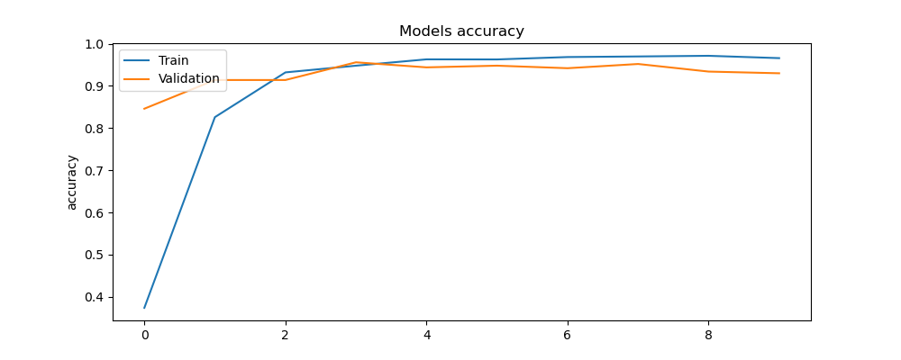 |
| InceptionV3 | 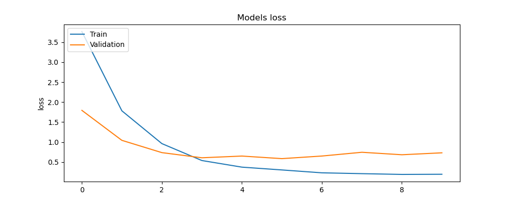 | 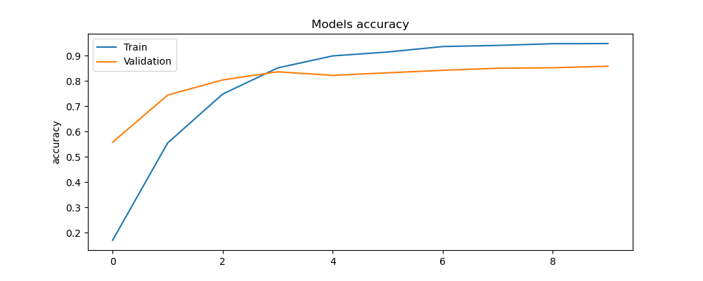 |


### Architecture used to generate this accuracy 

```py
# Where MODEL = ResNet50, MobileNetV2, VGG16, EfficientNetV2L, InceptionV3
model.add({MODEL}(include_top=False,
                    pooling='avg',
                  input_shape=(IMAGE_SIZE,IMAGE_SIZE,3),
                  weights='imagenet',
                   classes=100))
model.add(Flatten())
model.add(Dense(512, activation='relu'))
model.add(Dropout(0.5)) 
model.add(Dense(100, activation='softmax'))
model.compile(optimizer=Adam(learning_rate=0.0001),
             loss='categorical_crossentropy',
             metrics=["accuracy"])
```

- The input from the preceding layer is flattened into a 1D array by the Flatten layer. This makes it possible to provide data to a layer that is fully connected.
- We build a dense layer with 512 units as our second step.
- Then, during training, we include a drop-out layer that randomly removes a portion of the layer's neurons. This forces the model to learn stronger features, which helps minimize overfitting. 
- Finally, a 100-unit layer with a softmax activation function is added. The last layer's output is transformed into a probability distribution over the various classes with the use of the softmax function.
- The model is then assembled using an Adam optimizer to update the weights using categorical_crossentropy as the loss function to calculate the discrepancy between the expected and actual results. 

### Understanding resnet50 model and its performance for the dataset? 

- The resnet model is a heavy weight model consisting of 50 layers. 
- The resnet model is known for using residual blocks which helps in overcoming the vanishing gradient problem due to the depth of the model which has been a major issue in previous CNN models.[3] 
- The reason why residual blocks are considered very effective is because it uses skip connections that allows information to bypass one or more layers in the network, which enables the gradient to flow more easily during training.
[3] 
- Each residual block consists of two or three convolution layers, followed by skip connection that adds the inputs to the outputs of the block.[3]
- This allows the network to learn a residual mapping, which is the difference between the input and output of the block, rather than trying to learn the entire mapping from scratch.[3]
- **Accuracy vs Epochs graphs** : Based on the graph there is a large gap between training and validation accuracy(in comparison to other models) which signifies that there is over-fitting. [9]
- **Loss vs Epochs graphs** : Based on the training loss it is clearly visible that the loss is happening with a good learning rate and a similar trend is occurring for the validation data. [9]

### Understanding MobileNetV2 model and its performance for the dataset?

- The MobileNetV2 is a convolution neural network (CNN) architecture that is lightweight and efficient neural network designed to run on mobile devices and embedded systems with limited computational resources.[4]
- What makes MobileNetV2 architecture unique is the use of inverted residual blocks, which allows for a deeper network while reducing the computational cost. [4]
- The inverted residual blocks use a combination of ```1*1``` and depthwise ```3*3``` convolutions to reduce the number of parameters in the network, while still maintaining high level of accuracy. [4]
- The architecture also includes several other optimizations, such as linear bottlenecks, which allow for more efficient use of the network's computational resources.[4]
- The model also uses a new activation function called "swish", which has shown to improve the performance over traditional activation functions called ReLu.[4]
- **Accuracy vs Epochs graphs** : In comparison to the ResNet50 model this model has less over fitting as the area between the training and testing data is low in comparison to previous model. But the model looks to perform better than the previous model in terms of accuracy. [9]
- **Loss vs Epochs graphs** : Based on the training loss it is clearly visible that the loss is happening with a good learning rate and a similar trend is occurring for the validation data. [9]


### Understanding VGG16 model and its performance for the dataset?
- The VGG16 deep neural network model consisting of 16 layers, including 13 convolution layers and 3 fully connected layers. [5]
- The main features of the VGG16 architecture is all the convolution layers have the same spatial resolution ```(224X224)``` and use small ```3*3``` filters, which are followed by max pooling layers. - The design is based on the observation that the use of small filters is more effective than large filters for capturing spatial features in images. [5]
- There is one limitation with this architecture is its large number of parameters, which can make it computationally expensive to train.[5]
- **Accuracy vs Epochs graphs** : The model performed very differently when compared to other models as there was no increase in accuracy till the 4th epoch and then the training and validation graphs started increasing. What is interesting to see is when the accuracy starts increasing for training data the accuracy for validation data also increases in a similar fashion and the gap between both the graphs is very less[9]. It is most likely that the model will be performing well if the number of epochs are increased and considering our experiment to see which model perform wells under minimal epochs this model performed the worst.
- **Loss vs Epochs graphs** : Even the loss function didn't decrease till the 4th epoch and started decreasing stably from the 4th epoch. But after that the decrease in model loss is decreasing in a similar fashion for both 
train and validation data. [9]

### Understanding EfficientNetV2 model and its performance for the dataset?

- The EfficientNetV2 is a CNN model is an advanced version of Efficient Net architecture. [6]
- The main innovation of EfficientNetV2 is the use of a type of building block called "Squeeze-Excite" (SE) blocks. [6]
- The SE blocks use a combination of global average pooling and a set of fully connected layers to learn how to weight the importance of different feature maps in the network.[6]
- This allows the network to focus on the most important features and discard the less important ones, leading to better efficiency and accuracy. [6]
-  EfficientNetV2 also includes several other optimizations, such as using a new type of activation function called "Swish-SE", which combines the Swish activation function with the SE block to further improve the performance. [6]
- The above Swish-SE activation was also observed in MobileNetV2 which gives high accuracy. [6]
- **Accuracy vs Epochs graphs** : From the graph it is clearly visible that this graph has the maximum convergence between train and validation data curve hence will provide high accuracy in comparison to other models. Being a light weight model this performance is expected from EfficientNetV2.[9]
- **Loss vs Epochs graphs** : The loss function is also very stable for the train and validation model which is expected based on the accuracy vs epochs graph. [9]

### Understanding InceptionV3 model and its performance for the dataset?

- The InceptionV3 is a CNN model with 48 layers, including 3 inception modules, which are a type of multi-branch convolution layers that combine multiple filter sizes in parallel. [7]
- The main feature of the InceptionV3 architecture is its ability to capture a wide range of features at different scales using branches with different filters sizes ```(1*1, 3*3, and 5*5)``` and a max pooling branch. [7]
- The output of each branch is concatenated and passes to the next layer, this design allows the network to capture features at different scales and learn more expensive representations of the input images.[7]
- The model also includes optimizations, such as the use of batch normalization and an auxiliary classifier to help with gradient propagation during training.[7]
- The inceptionV3 has the same limitation of VGG16, it has large parameters making it computationally expensive.[7]
- **Accuracy vs Epochs graphs** : Based on the graph it performed similar to resnet50 and mobileNetV2. But performance wise InceptionV3 has performed badly because of large gap between training accuracy and validation accuracy. [9]
- **Loss vs Epochs graphs** : Based on the training loss it is clearly visible that the loss is happening with a good learning rate and a similar trend is occurring for the validation data. [9]


**Results of all the Image processing models**

|                 |   ResNet50 |   EfficientNetV2 |   InceptionV3 |    VGG16 |   MobileNetV2 |
|:----------------|-----------:|-----------------:|--------------:|---------:|--------------:|
| model_accuracy  |   0.898    |         0.946    |      0.866    | 0.684    |      0.924    |
| model_precision |   0.922845 |         0.955127 |      0.896659 | 0.697659 |      0.938274 |
| model_recall    |   0.898    |         0.946    |      0.866    | 0.684    |      0.924    |
| model_f1        |   0.895796 |         0.945441 |      0.863672 | 0.664598 |      0.919539 |

**Terms used**
- **Accuracy**: The percentage of correctly identified samples to all the samples in the dataset is called accuracy. It provides a broad indication of how successfully the model can categorise the data.  [8]
- **Precision**:  Precision is the ratio of accurate positive predictions to all of the model's positive predictions. It evaluates the model's accuracy in identifying positive samples.  [8]
- **Recall**: Recall is the ratio of correctly predicted true positives to all of the dataset's correctly predicted true positives. It assesses the model's capacity to correctly detect every positive sample, including potential outliers.  [8]
- **F1 score**: The F1 score, which represents a balanced measurement of both measures, is the harmonic mean of precision and recall. It is a standard measurement for binary classification issues.  [8]

### Observation based on the Image classification experiments

- It is clearly visible from the above experiments that as the dataset is a small dataset the light weight models MobileNetV2 and EfficientNetV2 has performed well in comparison to other models as these models are designed for a resource-constrained environment and can be trained effectively with relatively small amount of data. 
- Eventhough the Resnet50 and InceptionV3 are heavy weight models and require a lot of epochs to train it has performed significantly well with an accuracy of 89.8% and 86.6% within 10 epochs.
- The least performing model is the VGG16 model which is clearly visible based on the graph. 
- The VGG16 model gas a large number of parameters, which make it show to train and require more epochs to achieve high accuracy. As a result, the model may require more epochs to learn the features. [5]

## Results obtained from Classification of medical texts

The main focus of this evaluation is to see which models performs well with less number of epochs(10 epochs).

| Model | Loss vs Epochs | Accuracy vs Epochs |
| --- | --- | --- |
| CUSTOM TOKEN EMBEDDING | 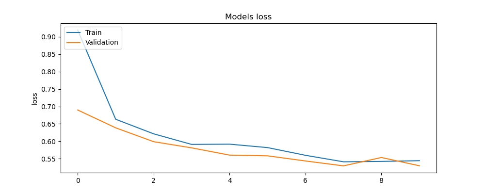 | 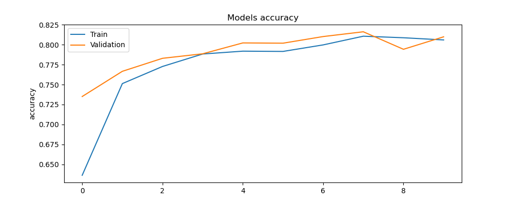 |
| UNIVERSAL TOKEN EMBEDDINGS | 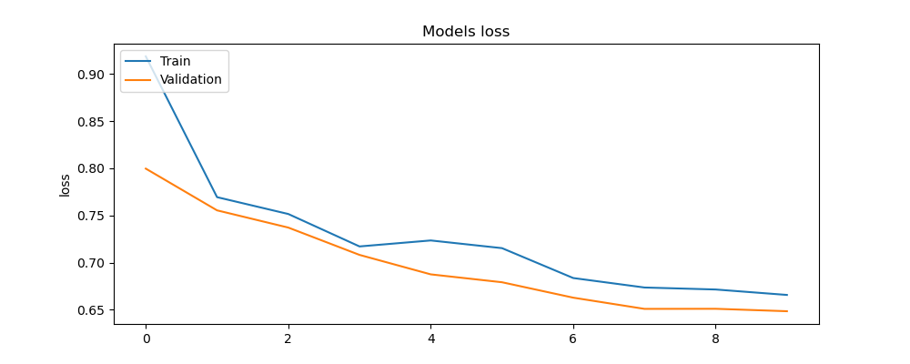 | 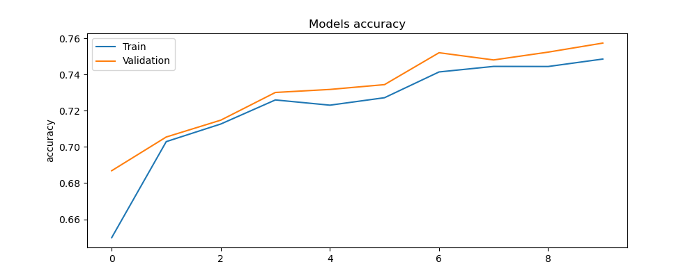 |
| LELLA | 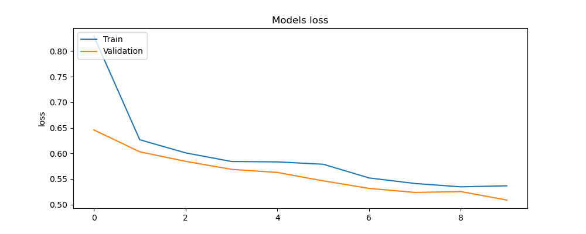 | 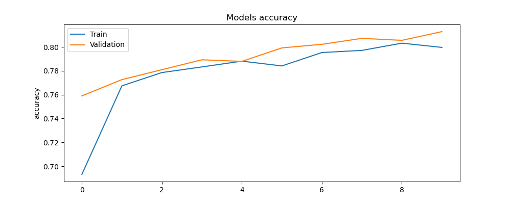 |


### Architecture used to generate this score

```py
inputs = layers.Input(shape=(1,), dtype=tf.string)
text_vectors = text_vectorization(inputs) 
token_embeddings = token_embedded_layers(text_vectors) 
x = layers.Conv1D(64, kernel_size=5, padding="same", activation="relu")(token_embeddings)
x = layers.GlobalAveragePooling1D()(x) 
outputs = layers.Dense(num_classes, activation="softmax")(x)
model_1 = tf.keras.Model(inputs, outputs)

# Compile
model_1.compile(loss="categorical_crossentropy",
                optimizer=tf.keras.optimizers.Adam(),
                metrics=["accuracy"])
```
- To begin, we establish an input layer that accepts text inputs as strings with the shape (32,1).
The text inputs are then converted into a sequence using text vectorization, which is based on the input layer. 
- Next, an embedding layer is built, mapping integer tokens to dense vector representation.
- To the token embeddings, we apply a 1D convolution layer with 64 filters and a kernel size of 5. The padding is configured to have an output length equal to the input length.
- The feature vector's output from the convolutions layer, which condenses it, is the global average pooling. 
- With a softmax activation function, the final output has a dense layer with 5 output channels.


### Understanding Custom token embedding model and its performance for the dataset?
- The custom token embedding was made my using the TextVectorization from the training data with a MAX token size of 55.
- After vecorizing the texts it was understood the custom model was made with a vocabulary of 64841.
- The configurations used for the text vectorization are
    - trainable: True,
    - dtype: string,
    - batch_input_shape: (None,),
    - max_tokens: 68000,
    - standardize: 'lower_and_strip_punctuation',
    - split: 'whitespace',
    - ngrams: None,
    - output_mode: int,
    - pad_to_max_tokens: False,
    - sparse: False,
    - ragged: False,
    - Vocabulary: None,
    - idf_weights: None,
    - encoding: "utf-8"
- **Accuracy vs Epochs graphs** : Based on the graph the model performance very well as there is very less over fitting as the area between the  validation curve and training curve is very less. 
- **Loss vs Epochs graphs** : Based on the graph there is stable loss for the following model and the rate with which it reduces also signifies that the learning rate of the model is very good. 


### Understanding Universal token embedding model and its performance for the dataset?
- The Universal Sentence Encoder encodes text into high-dimensional vectors that can be used for text classification, semantic similarity, clustering and other natural language tasks.[10]
- It is trained on a variety of data sources and a variety of tasks with the aim of dynamically accommodating a wide variety of natural language understanding tasks. The input is variable length English text and the output is a 512 dimensional vector.[10]
- **Accuracy vs Epochs graphs** : Based on the graph the area between loss curve and accuracy curve is little higher in comparison to previous model hence the performance will be little less to custom token embedding model. 
- **Loss vs Epochs graphs** : Based on the graph there is stable loss for the following model and the rate with which it reduces also signifies that the learning rate of the model is very good. 

### Understanding LELLA(Learning Lightweight Language-agnostic Sentence Embeddings with Knowledge Distillation) token embedding model and its performance for the dataset?
- LEALLA encodes text into low-dimensional vectors. It is faster for inference because LEALLA contains fewer model parameters compared with LaBSE. [11]
- LEALLA also accelerates applications to downstream tasks because it generates low-dimensional sentence embeddings. [11]
- Same as LaBSE, LEALLA is trained and optimized to produce similar representations exclusively for bilingual sentence pairs that are translations of each other. [11]
- So it can be used for mining translations of sentences in a larger corpus. LEALLA is further enhanced by knowledge distillation from LaBSE. [11]
- **Accuracy vs Epochs graphs** : Bases on the graph the model performed really well as the area between the validation curve and the train curve is less in comparison to universal sentence encoder.
- **Loss vs Epochs graphs** : Based on the graph there is stable loss for the following model and the rate with which it reduces also signifies that the learning rate of the model is very good. 


**Results of all the text classification models**

|                 |   TokenEmbededNLP |   UniversalEmbededNLP |   LEALLAEmbededNLP |
|:----------------|------------------:|----------------------:|-------------------:|
| model_accuracy  |          0.806537 |              0.743753 |           0.799569 |
| model_precision |          0.801788 |              0.738336 |           0.795175 |
| model_recall    |          0.806537 |              0.743753 |           0.799569 |
| model_f1        |          0.80302  |              0.73882  |           0.79613  |

### Observation based on the Text classification experiments
- Bases on the test suited the custom token embedding model made with training data performed really well but I strongly feel that when it comes to deployment LEALLA EMbedded model will be much better as it will be able to encode new abstract sentences with latest vocabulary as the vocabulary of the custom token embedded model is constrained and limited. 
- The model is trained on a corpus of 20,000 but the actual corpus of 2,00,00 will provide a better idea about the vocabulary. 


## References

[1] Dernoncourt, Franck, and Ji Young Lee. PubMed 200k RCT: A Dataset for Sequential Sentence Classification in Medical Abstracts. arXiv, 16 Oct. 2017. arXiv.org, https://doi.org/10.48550/arXiv.1710.06071.


[2] 100 Sports Image Classification. https://www.kaggle.com/datasets/gpiosenka/sports-classification. Accessed 19 Apr. 2023.


[3] Kaiming He, Xiangyu Zhang, Shaoqing Ren, Jian Sun. Deep Residual Learning for Image Recognition. arXiv:1512.03385, 2015. https://arxiv.org/abs/1512.03385

[4] Mark Sandler, Andrew Howard, Menglong Zhu, Andrey Zhmoginov, Liang-Chieh Chen. MobileNetV2: Inverted Residuals and Linear Bottlenecks. Proceedings of the IEEE Conference on Computer Vision and Pattern Recognition, 2018. https://arxiv.org/abs/1801.04381

[5] Karen Simonyan, Andrew Zisserman. Very Deep Convolutional Networks for Large-Scale Image Recognition. arXiv:1409.1556, 2014. https://arxiv.org/abs/1409.1556

[6] Mingxing Tan, Quoc V. Le. EfficientNetV2: Smaller Models and Faster Training. arXiv:2104.00298, 2021. https://arxiv.org/abs/2104.00298

[7] Christian Szegedy, Vincent Vanhoucke, Sergey Ioffe, Jonathon Shlens, Zbigniew Wojna. Rethinking the Inception Architecture for Computer Vision. arXiv:1512.00567, 2015. https://arxiv.org/abs/1512.00567

[8] Naveen. “What Is Precision, Recall, Accuracy and F1-Score?” Nomidl, 27 Feb. 2022, https://www.nomidl.com/machine-learning/what-is-precision-recall-accuracy-and-f1-score/.

[9] Jose, George V. “Useful Plots to Diagnose Your Neural Network.” Medium, 3 Oct. 2019, https://towardsdatascience.com/useful-plots-to-diagnose-your-neural-network-521907fa2f45.

[10] TensorFlow Hub. https://tfhub.dev/google/universal-sentence-encoder/4. Accessed 21 Apr. 2023.

[11] TensorFlow Hub. https://tfhub.dev/google/LEALLA/LEALLA-base/1. Accessed 21 Apr. 2023.

